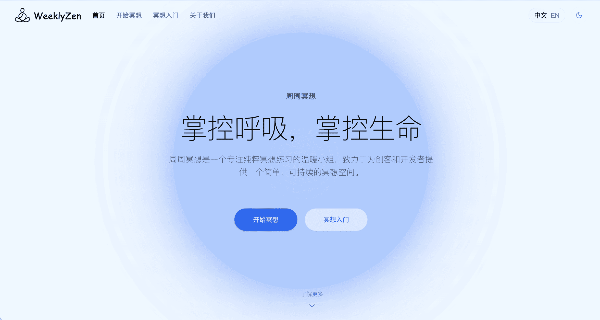

# Zen | 简单冥想 - 作品提交

## 一、基本信息

### 作品名称
Zen（简单冥想）

### 作品简介
Zen 是一个基于 AI 的个性化冥想引导平台，通过分析用户分享的困扰和压力，生成针对性的冥想音频内容。它是首个将 AI 大模型应用于冥想内容生成的公益项目，致力于为创客和开发者群体提供心理减压服务。

### 目标人群
- 主要面向创客和开发者群体
- 经常面临项目压力和工作焦虑的技术从业者
- 对冥想感兴趣但缺乏引导的初学者

### 解决什么问题
1. 传统冥想内容过于通用，缺乏针对性
2. 创客群体普遍面临高压力但缺乏适合的减压方式
3. 现有冥想 App 收费高昂，且很少关注技术从业者的特殊需求

### 作品代码仓库
- GitHub：https://github.com/makerjackie/Zen
- 线上体验：https://zen.01mvp.com

## 二、作品介绍

### 创新性
1. **AI 驱动的个性化内容**
   - 首创将 AI 大模型应用于冥想内容生成
   - 基于用户输入（近期烦恼 & 疑惑）实时生成针对性的冥想引导

2. **技术创新**
   - 使用豆包语音合成大模型
   - 创新的呼吸动画引导系统
   - 全新的冥想内容生成框架

### 业务完整性
1. **完整的用户旅程**
   - 冥想基础知识科普
   - 个性化内容生成
   - 进度追踪与反馈

2. **核心功能**
   - 多语言支持（中/英）
   - AI 个性化引导
   - 冥想计时器 + 多种背景音效
   - 主题切换系统
   - 多个冥想引导语（冥想入门、观察呼吸、扫描身体）

### 应用效果
1. **用户体验**
   - 简洁直观的界面设计
   - 流畅的交互体验
   - 沉浸式的冥想环境

2. **实际效果**
   - 帮助用户缓解工作压力
   - 提供针对性的心理支持
   - 培养可持续的冥想习惯

### 商业价值
1. **社会价值**
   - 为创客群体提供免费的心理健康支持
   - 推广健康的减压方式
   - 建立可持续的冥想社区

2. **发展潜力**
   - 可扩展到更广泛的用户群体
   - 未来可开发企业服务版本
   - 潜在的商业化路径（保持基础功能免费）

## 三、作品展示

### 技术架构
1. **前端技术栈**
   - Next.js 15 (App Router)
   - React 18
   - TypeScript
   - Tailwind CSS
   - Shadcn UI
   - Framer Motion

2. **AI 与语音技术**
   - AI 大模型：采用 Doubao Pro
   - 豆包大模型语音合成

### 核心功能展示



1. **个性化引导流程**
   ```
   用户输入 -> AI 分析 -> 生成引导内容 -> 语音合成 -> 开始冥想
   ```

2. **呼吸引导动画**
   - 可视化的呼吸节奏控制
   - 自适应的动画速度

### 使用方法
1. 访问 https://zen.01mvp.com
2. 点击"开始冥想"
3. 分享当前的困扰或压力
4. 获取个性化的冥想引导
5. 跟随语音指引进行冥想

### 代码示例
```typescript
// AI 引导生成核心逻辑
async function generateMeditationGuidance(
  userInput: string
): Promise<MeditationResponse> {
  // 分析用户输入
  const analysis = await analyzeUserNeeds(userInput);
  
  // 生成个性化引导内容
  const guidance = await generateContent(analysis);
  
  // 转换为语音
  const audio = await textToSpeech(guidance.text);
  
  return {
    guidance,
    audio,
    duration: guidance.recommendedDuration,
  };
}
```

## 四、团队故事

### 项目起源
作为经常参加黑客松的开发者，我们深知创客群体面临的压力。这促使我们思考：如何将 AI 技术应用于心理健康领域，特别是为创客群体提供帮助？

### 技术挑战
1. **语音合成优化**
   - 初期语音效果不够自然
   - 通过优化提示词和参数调整改善
   - 计划支持更多音色选择

2. **AI 内容生成**
   - 确保生成内容的专业性和安全性
   - 建立冥想内容知识库
   - 优化多轮对话体验

### 未来规划
1. **近期目标**
   - 优化语音合成效果
   - 扩充冥想内容库
   - 增加用户反馈系统

2. **长期愿景**
   - 持续打磨这个小型冥想网站
   - 开发更多轻量但有用的练习功能
   - 保持简洁、安静、易用

## 五、补充说明

本项目是一个小型公益冥想网站，致力于为更多人提供免费、轻量、易开始的冥想体验。我们相信，通过技术创新，可以让更多人受益于冥想带来的平静与力量。 
